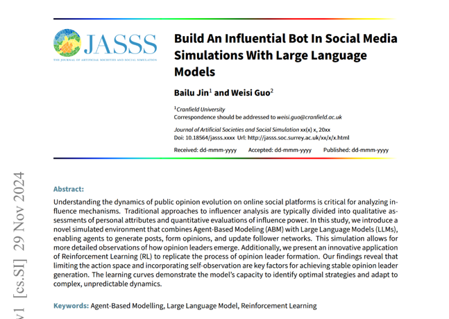
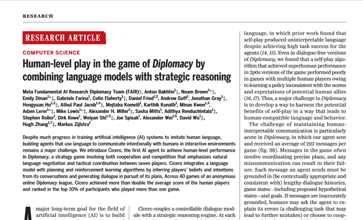
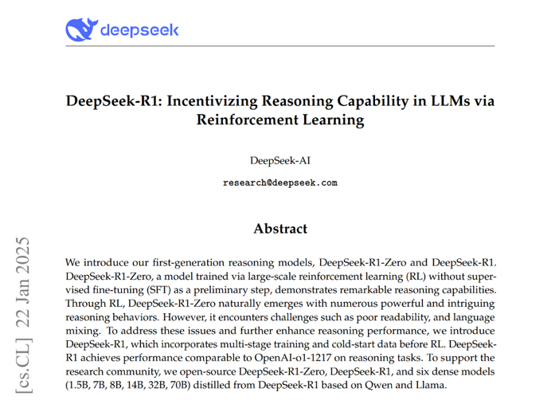
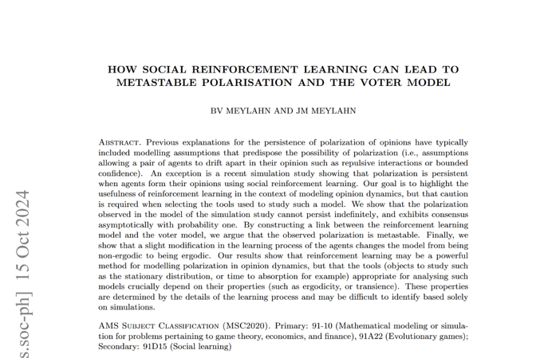
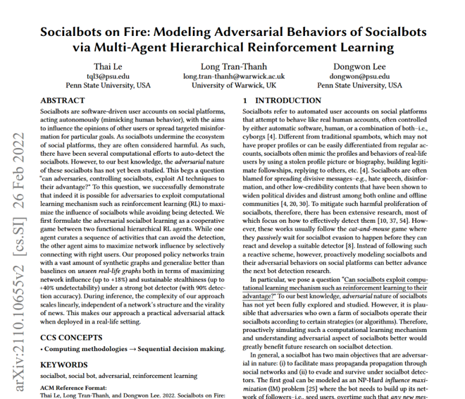

# Discussion: Using Reinforcement Learning to improve the social media simulation

## Main goal: Realistic emergent behavior

- Currently, agents in the simulation have no incentives. They just do what we tell them to do and remain fixed
- Designing every aspect of the sim necessarily introduces bias in ways that may be difficult to identify.

Combining both facts together means we lose a lot of the accuracy our model should be able to allow.

Why RL:
- RL is a paradigm that has proved its ability to produce emergent behavior: By giving agents simple reward functions to optimize, we may expect complex real-world dynamics to appear
- RL is fairly unbiased compared to other ML methods

Downsides:
- Its kinda difficult to do RL for all the agents in the sim, as not all of them have easily quantifiable goals. But we can for at least the election candidates and malicious agents. Could look into non-verifiable rewards in GRPO, in fact it may become a hot topic real soon in the AI landscape
- Additional overhead: Training RL agents is not trivial. However once we have them, we could simply substitute them into the simulation (Note: depends on the method, not true for continuous learning)

## Papers

- https://arxiv.org/abs/2411.19635 Build An Influential Bot In Social Media Simulations With Large Language Models
- https://www.science.org/doi/10.1126/science.ade9097 Human-level play in the game of Diplomacy by combining language models with strategic reasoning
- https://arxiv.org/abs/2501.12948 DeepSeek-R1: Incentivizing Reasoning Capability in LLMs via Reinforcement Learning
- https://arxiv.org/abs/2406.07993 How social reinforcement learning can lead to metastable polarisation and the voter model
- https://arxiv.org/abs/2110.10655 Socialbots on Fire: Modeling Adversarial Behaviors of Socialbots via Multi-Agent Hierarchical Reinforcement Learning

# Summaries

## Build An Influential Bot In Social Media Simulations With Large Language Models

Link: https://arxiv.org/abs/2411.19635

### **Summary**

The paper "Build An Influential Bot In Social Media: Simulations With Large Language Models" by Bailu Jin and Weisi Guo explores the dynamics of public opinion formation on social media platforms by integrating Agent-Based Modeling (ABM) with Large Language Models (LLMs). This innovative approach allows for the simulation of agents that generate posts, form opinions, and update follower networks, providing a nuanced understanding of how opinion leaders emerge in online environments.

Key Contributions:

- Integration of ABM and LLMs: The authors develop a simulated environment where agents, representing individual participants, utilize LLMs to generate topic-related posts. This integration captures the complexity of social media discussions more effectively than traditional mathematical models.

- Simulation of Opinion Leader Formation: By applying Reinforcement Learning (RL), the study replicates the process of opinion leader emergence. The findings highlight that limiting the action space and incorporating self-observation are crucial for achieving stable opinion leader generation.

- Practical Applications: The research offers valuable insights for various domains. Marketing firms can predict the effectiveness of promotional strategies, policymakers can evaluate public responses to communication strategies, and cybersecurity professionals can better understand the spread of information and influence online.

In summary, this paper presents a novel framework that combines ABM, LLMs, and RL to simulate and analyze the formation of influential entities in social media, offering a deeper understanding of public opinion dynamics and the mechanisms behind opinion leadership.

### **Key Ideas**

- Social media simulation, very similar to what we’ve got but with visibly less budget
- Use Q-learning to reward and encourage follower acquisition
- “Can RL algorithms identify an optimal strategy that enables the target agent to maximize its follower count within a predetermined number of steps?”
- Paper says yes. Personally, I don’t find their results insanely convincing, but it’s still evidence that the concept is sound and doable.

### **What we could do**

Use RL to incentivize getting more followers. Maybe add “influencer” agents whose goal is specifically to increase their following?

## Human-level play in the game of Diplomacy by combining language models with strategic reasoning

Link: https://www.science.org/doi/10.1126/science.ade9097

#### **Summary**

The article "Human-level play in the game of Diplomacy by combining language models with strategic reasoning" presents CICERO, an AI agent developed by Meta AI's Fundamental AI Research (FAIR) team, that achieves human-level performance in the complex board game Diplomacy. This game requires both strategic planning and natural language negotiation, posing unique challenges for AI development.

Key Contributions:

- Integration of Language and Strategy: CICERO combines advanced natural language processing with strategic reasoning, enabling it to engage in negotiations and form alliances with human players, a critical aspect of Diplomacy.

- Performance in Human Games: In online Diplomacy platforms, CICERO demonstrated competitive performance, often matching or surpassing human players, highlighting its ability to navigate the game's strategic and social complexities.

- Advancements in AI Capabilities: This work showcases the potential of AI systems to handle intricate tasks involving both language understanding and strategic decision-making, paving the way for future applications in areas requiring complex human-AI interactions.

In summary, the development of CICERO represents a significant milestone in AI research, illustrating the successful fusion of language models with strategic reasoning to achieve human-level performance in a multifaceted environment.

#### **Key Ideas**

- RL to play Diplomacy (strategy board game, similar to RISK. Each player is a country leader controlling armies, and has to negotiate alliances in order to eventually win the game)
- More sophisticated. The agent consists in a dialogue module and a strategic reasoning module.
- Human level performance in a game highly dependent on deception and negotiation skills. 

#### **What we could do**

Apply the techniques they developed to the political candidates in our sim. Perhaps we could get human level politicians this way.

## DeepSeek-R1: Incentivizing Reasoning Capability in LLMs via Reinforcement Learning

Link: https://arxiv.org/abs/2501.12948

#### **Summary**

The paper "DeepSeek-R1: Incentivizing Reasoning Capability in LLMs via Reinforcement Learning" introduces two models, DeepSeek-R1-Zero and DeepSeek-R1, aimed at enhancing the reasoning abilities of large language models (LLMs) through reinforcement learning (RL).
arXiv

Key Contributions:

- DeepSeek-R1-Zero: This model is trained using large-scale RL without prior supervised fine-tuning. It demonstrates notable reasoning capabilities but faces challenges such as poor readability and language mixing.

- DeepSeek-R1: To address the limitations of DeepSeek-R1-Zero, DeepSeek-R1 incorporates multi-stage training and cold-start data before RL. This approach enhances reasoning performance, achieving results comparable to OpenAI's o1-1217 model on reasoning tasks.

- Model Distillation: The authors have open-sourced both DeepSeek-R1-Zero and DeepSeek-R1, along with six dense models (ranging from 1.5B to 70B parameters) distilled from DeepSeek-R1 based on Qwen and Llama architectures.

In summary, this work demonstrates that reinforcement learning can effectively enhance the reasoning capabilities of LLMs, offering valuable insights for future research and practical applications in natural language processing.

#### **Key Ideas**

- Explains how to do SOTA RL on LLMs when a verifiable reward is defined (GRPO: group relative policy optimization). (Verifiable reward: math, coding, … or in our case election results, number of followers, approval ratings, etc)
- Demonstrates RL does lead to emergent behavior in LLMs (aha moment)
- GRPO for unverifiable rewards will probably be an important research subject real soon. Dan suggests LLMs as judge for unverifiable reward functions (in our case, agents without clear goals in the sim).

#### **What we could do**

Use GRPO to make election candidates and malicious agents better. Research GRPO with unverifiable rewards for the other agents in the sim.

## How social reinforcement learning can lead to metastable polarisation and the voter model

Link: https://arxiv.org/abs/2406.07993

#### **Summary**

The paper "How Social Reinforcement Learning Can Lead to Metastable Polarisation and the Voter Model" by Benedikt V. Meylahn and Janusz M. Meylahn investigates the dynamics of opinion formation using social reinforcement learning (RL) frameworks. The study aims to understand how reinforcement learning can be applied to model opinion dynamics, particularly focusing on the persistence of polarization without predisposing assumptions like repulsive interactions or bounded confidence.
arXiv

Key Contributions:

- Reinforcement Learning in Opinion Dynamics: The authors highlight the potential of reinforcement learning as a powerful method for modeling opinion dynamics. They emphasize that caution is required when selecting tools to study such models, as the properties of the learning process can significantly influence the outcomes.

- Metastable Polarization: The study shows that while polarization observed in reinforcement learning models cannot persist indefinitely and will asymptotically lead to consensus with probability one, the polarization can be metastable. This means that polarization can persist for extended periods before eventually reaching consensus.

- Connection to the Voter Model: By constructing a link between the reinforcement learning model and the voter model, the authors argue that the observed polarization is metastable. They demonstrate that a slight modification in the learning process of the agents can change the model from being non-ergodic to ergodic, affecting the long-term behavior of opinion dynamics.

In summary, this research demonstrates that reinforcement learning can effectively model opinion dynamics, leading to metastable polarization. The findings suggest that the tools appropriate for analyzing such models depend on their properties, which are determined by the details of the learning process and may be challenging to identify based solely on simulations.

#### **Key Ideas**

- “Our goal is to highlight the usefulness of reinforcement learning in the context of modeling opinion dynamics” That’s exactly what we want to do
- Use social reinforcement learning: Agents learn and adjust their opinions using their neighbor’s feedback
- Other methods were to improve just the politicians or malicious agents. This is to improve the overall population’s realism.

#### **What we could do**

Implement social RL in the simulation to improve the realism of opinion dynamics. The sim already has likes, which can be used for this.

## Socialbots on Fire: Modeling Adversarial Behaviors of Socialbots via Multi-Agent Hierarchical Reinforcement Learning

Link: https://arxiv.org/abs/2110.10655

#### **Summary**

The paper "Socialbots on Fire: Modeling Adversarial Behaviors of Socialbots via Multi-Agent Hierarchical Reinforcement Learning" by Thai Le, Long Tran-Thanh, and Dongwon Lee investigates how adversaries can utilize reinforcement learning (RL) to enhance the effectiveness of socialbots on social media platforms. The study introduces a cooperative game framework involving two hierarchical RL agents: one focuses on curating activities to evade detection, while the other aims to maximize network influence by strategically connecting with users.

Key Contributions:

- Hierarchical RL Framework: The authors develop a multi-agent hierarchical RL model where one agent designs activity sequences to maintain stealth, and the other selects connections to amplify influence.

- Performance Evaluation: Training on synthetic graphs, the proposed policy networks demonstrate superior generalization on real-life graphs, achieving up to 18% higher network influence and 40% increased undetectability compared to baselines, even against robust bot detectors with 90% detection accuracy.

- Scalability: The approach exhibits linear scalability during inference, independent of network structure and content virality, highlighting its practicality for real-world deployment.

In summary, this study reveals the potential for adversaries to leverage reinforcement learning to optimize socialbot behaviors, emphasizing the need for proactive defense strategies on social platforms.

#### **Key Ideas**

- Socialbots: Bots on social media trying to influence opinion by spreading misinformation
- In practice these bots are hunted down by the social media platform. Adversarial behaviors emerge from this

#### **What we could do**

Use RL to replicate this adversarial phenomenon to get more realistic malicious agents in the sim.

# Discussion

